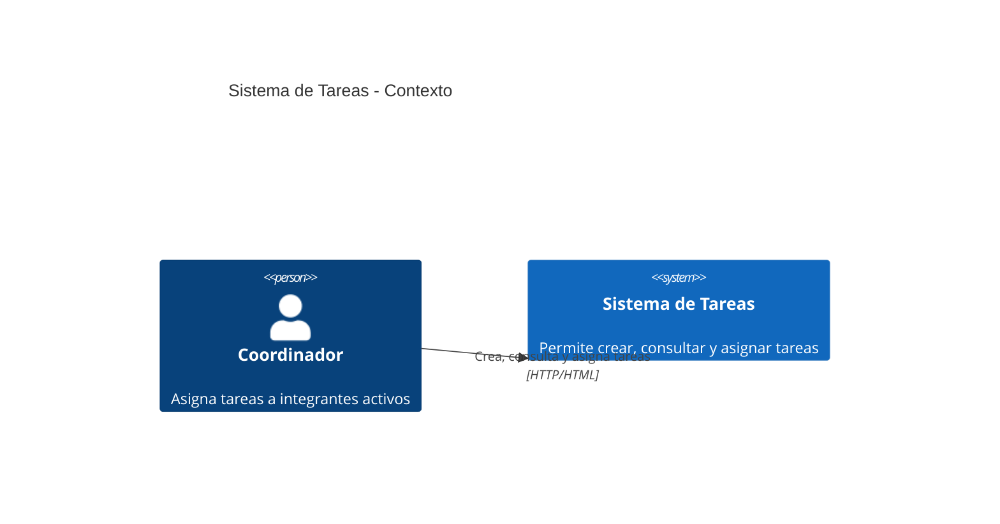
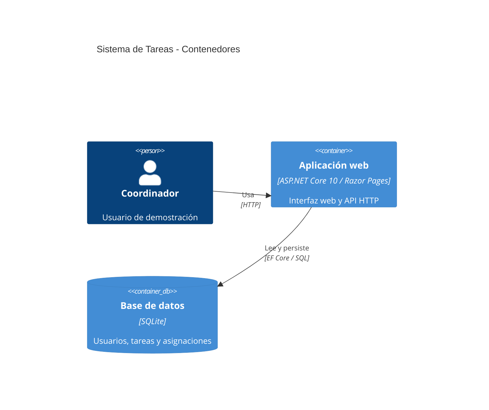
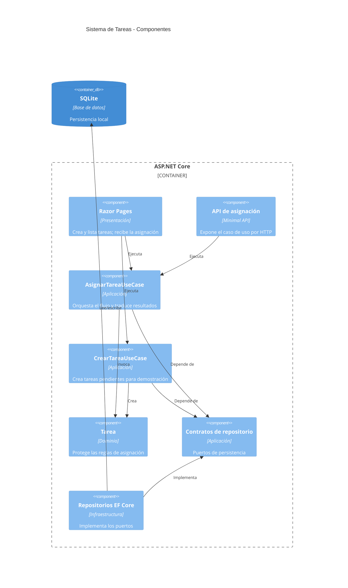
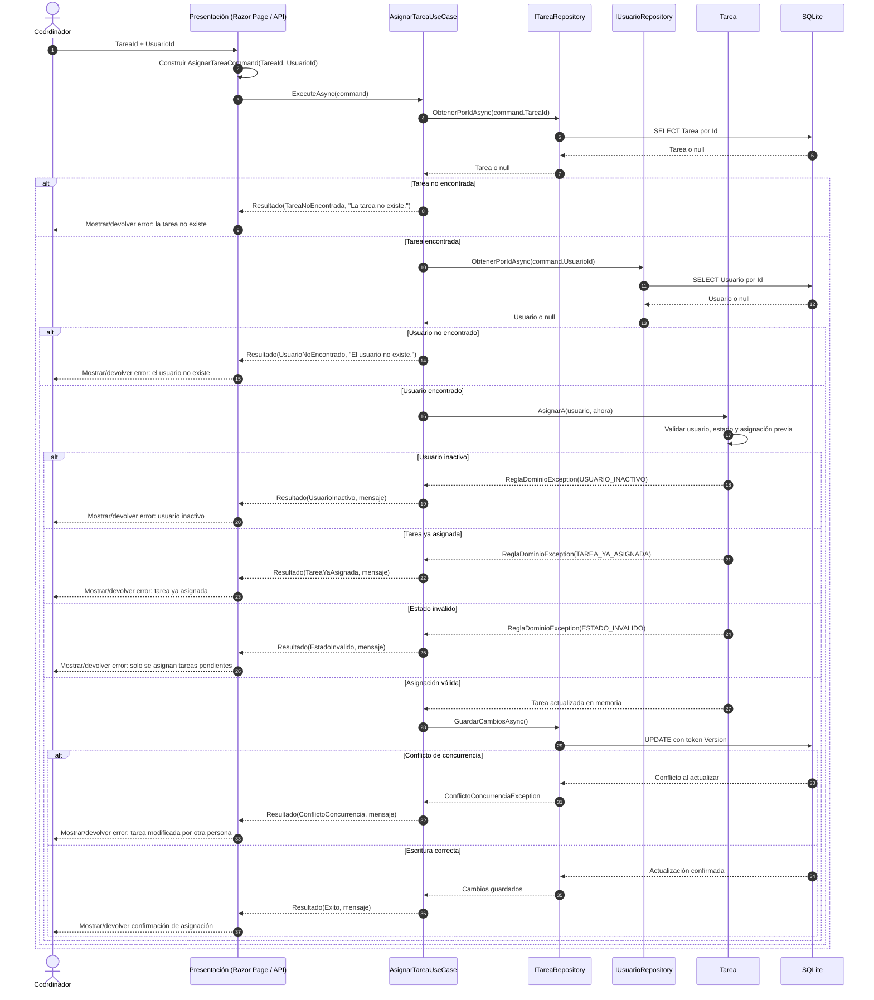

# Arquitectura del Sistema de Tareas — Grupo Barva

## Objetivo

El sistema implementa el flujo crítico **Asignar tarea** y una función auxiliar para crear tareas durante la demostración. Completar, notificar, auditar y reportar quedan fuera del alcance funcional y de la estrategia de pruebas del grupo Barva.

La solución es un monolito modular en capas. Se despliega como una sola aplicación, pero conserva fronteras explícitas para que el dominio y la aplicación no dependan de la web, Entity Framework Core ni SQLite.

## C4 nivel 1 — Contexto

## C4 nivel 2 — Contenedores

## C4 nivel 3 — Componentes

La única excepción de composición es `SistemaTareas.Web`: referencia Infrastructure para registrar adaptadores en `Program.cs`. Los PageModels no conocen `DbContext` ni repositorios.

## Secuencia del flujo Barva

## Reglas protegidas

- Domain no conoce Application, Infrastructure, Web ni Entity Framework.
- Application define casos de uso y contratos; no conoce adaptadores.
- Infrastructure implementa contratos con EF Core y SQLite.
- Web consume casos de uso, nunca `DbContext` ni repositorios directamente.
- La columna `Version` es un token de concurrencia optimista; dos asignaciones simultáneas no pueden sobrescribirse silenciosamente.
